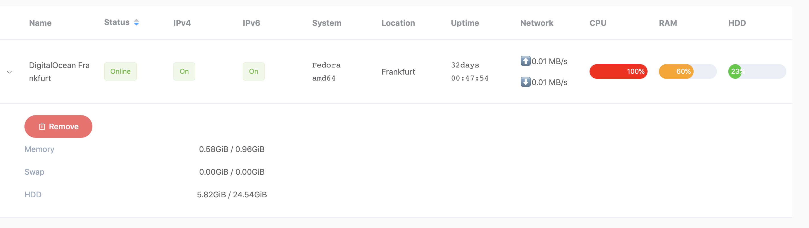

# Server Status

## Screenshot

### temp page:


### saved page:



## Description

Server Status is a monitor to have a quick look at all your servers(Linux and OS X supported).

Everytime a new client come in, it will be added into temp servers.

Click Save and the client will be moved to saved servers.

Click Delete and the client will be deleted from temp servers.

In saved servers, click Remove and the client will be moved to temp servers.

If there is no status received from a client in the past 30 seconds, it will be marked as "Offline".

If there is no status received from a client in temp servers in the past 3 days, it will be deleted automatically.

## Build

### Clone the repo

```bash
git clone https://github.com/goomadao/serverstatus.git && cd serverstatus
```

### Build client
   
```bash
make client
```

### Build server(npm needed)

```bash
make server
```

### Build client and server(npm needed)

```bash
make
```

## Usage

```bash
cd bin
```

### Server

Use -h for help
```bash
$ ./server -h
serverstatus server
Usage: serverstatus -k password [-p udpPort] [-P dashboardPort] [-L logFile] [-level logLevel] [-f statusFile]
	
Options:
  -L string
    	The path to store the log file (default "./statusserver.log")
  -P int
    	The port for the dashboard (default 8080)
  -f string
    	The position to store received status (default "./status.json")
  -h	This help
  -k string
    	Password to connect to this server
  -level string
    	Log levels: [ debug, info, error] (default "error")
  -p int
    	The port to receive information from clients (default 36580)
```

For example:
```bash
./server -k yourPassword -p 36580 -P 8080 -L /tmp/statusserver.log -level error -f /tmp/status.json
```

### Client

Use -h for help
```bash
$ ./client -h
serverstatus client
Usage: serverstatus -k password -s serverAddress [-p port] [-L logFile] [-level logLevel] [-n serverName] [-l location]

Options:
  -L string
    	The path to store the log file (default "./statusclient.log")
  -h	This help
  -k string
    	Password to connect to server
  -l string
    	Location of this server
  -level string
    	Log levels: [ debug, info, error] (default "error")
  -n string
    	Name of this server
  -p int
    	The server port (default 36580)
  -s string
    	The server address or domain
```

For example:
```bash
./client -k yourPassword -s example.your.domain -p 36580 -n "Server Name" -l "Server Location" -L /tmp/statusclient.log -level info
```

## Todos
- [ ] Get current net speed on Mac. (I have no idea how to do that. Any idea about that is welcome!)
